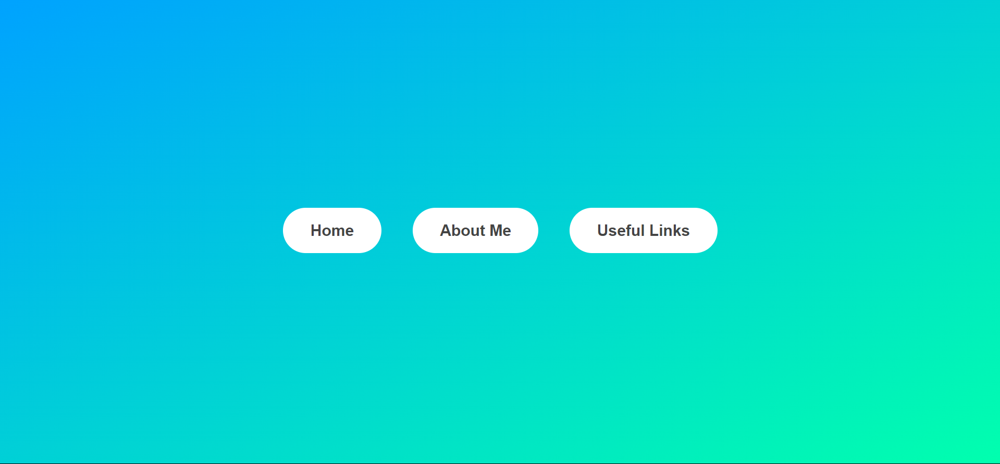

<h1 align="center">Modal Window 🪟<h1>

### Modal Window mini-project by HTML, CSS and Javascript.
### Main project written by "Jonas Schmedtmann" from "Udemy".
### In this project we use Javascript to handle enents according to a window in webpage. 
### Run the program with live-server on `index.html`
### See demo in [This URL](https://devmasen.github.io/modal-window/)
